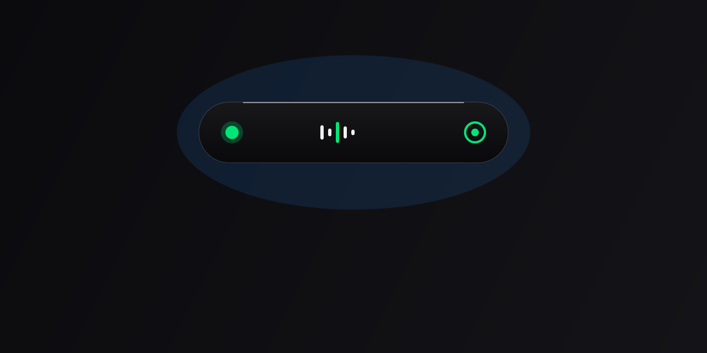

# Sagar Island — Dynamic Island for Windows 11 / 10

<p align="center">
  
</p>

<p align="center">
  <b>A fluid, Apple-style Dynamic Island desktop utility natively crafted for Windows.</b><br>
  Featuring real-time hardware monitoring, live audio visualizer, SMTC media controls, clipboard companion, and smooth spring physics animations.
</p>

---

## ✨ Features

- 🏝️ **Adaptive Content-Aware Geometry**: Fluidly morphs between 9 distinct states (Resting Pill, Volume HUD, Mute HUD, Brightness HUD, Battery HUD, Media Compact, Media Expanded, Windows Notifications, and Clipboard companion).
- 🎵 **Windows Media Integration (SMTC)**: Automatically captures playback from Spotify, Apple Music, YouTube, and browsers with live 4-bar equalizer dancing, track info, seek bar, and playback controls (Previous, 10s Replay, Play/Pause, Next, 10s Forward).
- 🔊 **WASAPI Volume & Mute HUD**: Monitors endpoint master volume changes with instant visual response and red mute alert state.
- ☀️ **WMI Monitor Brightness HUD**: Seamlessly tracks system brightness changes with smooth progress bar animation.
- 🔋 **Win32 Battery Monitor**: Real-time power level and charging/low-battery status notifications.
- 📋 **Smart Clipboard Companion**: Detects copied text, URLs, image snapshots, and file lists with tailored badge glyphs and accent colors.
- 🔔 **Windows Notifications Listener**: Minimalist, non-intrusive companion banner for incoming desktop notifications.
- 🛡️ **Edge Wake-up & Auto-Hide**: Inactivity sensor automatically hides the resting island to prevent screen obstruction, waking up instantly when the cursor reaches the top bezel.
- ⚙️ **Customization & System Tray**: Full system tray integration with right-click menu, auto-start on boot, and customization dialog.

---

## 🚀 Installation & Downloads

### Option 1: Official Windows Installer (Recommended)
Download and run **`SagarIsland-Setup.exe`** from the [`dist-installer/`](dist-installer/SagarIsland-Setup.exe) folder.
- Sets up Desktop and Start Menu shortcuts
- Configures optional automatic launch on Windows startup
- Clean uninstaller via Windows Settings / Control Panel

### Option 2: Standalone Portable Binary
Run the self-contained executable directly without installation:
- [`publish/SagarIsland.exe`](publish/SagarIsland.exe) (No prerequisites needed; all .NET runtimes embedded).

---

## 🛠️ Building from Source

### Prerequisites
- Windows 10 (Build 19041+) or Windows 11
- [.NET 8.0 SDK](https://dotnet.microsoft.com/download/dotnet/8.0)
- [Inno Setup 6](https://jrsoftware.org/isinfo.php) (optional, for installer creation)

### 1-Click Automated Build
Run the build script in PowerShell:
```powershell
.\build-release.ps1
```

Or manually:
```powershell
# 1. Render all vector icon assets
dotnet run -- --generate-icons

# 2. Publish standalone single-file binary
dotnet publish -c Release -r win-x64 --self-contained true -p:PublishSingleFile=true -p:IncludeNativeLibrariesForSelfExtract=true -o "./publish"

# 3. Build setup installer
ISCC.exe installer.iss
```

---

## 🎮 Interaction & Controls

| Action | Behavior |
|---|---|
| **Hover on Pill** | Expands by +12px width with a snappy 160ms ease curve |
| **Click Resting Pill** | Opens the Smart Dashboard glance (Clock, Volume, Battery, Settings) |
| **Click while Media Playing** | Opens the Rich Media Expanded card with seek bar & playback controls |
| **Move Cursor to Top Edge** | Instantly wakes up and reveals the hidden island |
| **Right-Click System Tray Icon** | Toggle island ON/OFF, open Settings, or configure startup |

---

## 📄 License
This project is open-source under the [MIT License](LICENSE).
